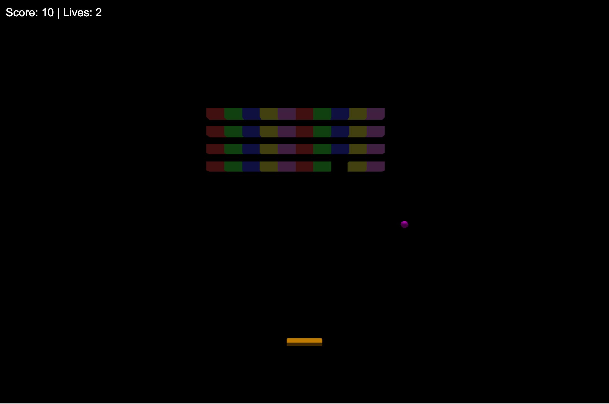

# Breakout 3D

  

A vibrant, 3D twist on the classic Breakout game built with Three.js. Control a paddle with your mouse, smash colorful bricks, and enjoy chiptune-inspired sound effects. Test your skills as you aim for a high score while managing limited lives!

## Features
- **3D Graphics**: Powered by Three.js with a colorful paddle, ball, and bricks.
- **Dynamic Lighting**: Ambient and directional lighting enhance the visual experience.
- **Chiptune Audio**: Retro-style sound effects for paddle hits, brick breaks, and background music.
- **Mouse Controls**: Move the paddle by hovering your mouse across the screen.
- **Score & Lives System**: Track your progress with an on-screen display.
- **Responsive Design**: Adapts to window resizing for a seamless experience.

## Demo
Try the game live [here](#) 

## Installation
1. **Clone the Repository**:
   ```bash
   git clone https://github.com/makalin/Breakout3D.git
   cd Breakout3D
   ```
2. **Serve the File**:
   Since this is a single HTML file with a CDN dependency, you’ll need a local server to run it due to browser security restrictions. Use one of these options:
   - **VS Code**: Install the "Live Server" extension and open `index.html`.
   - **Python**: Run `python -m http.server 8000` in the project directory, then visit `http://localhost:8000` in your browser.
   - **Node.js**: Use `npx serve` after installing Node.js.

3. **Dependencies**:
   - The game uses Three.js (v134) via a CDN, so no additional installation is required.

## Usage
- Open the game in your browser.
- Move your mouse left or right to control the paddle.
- Break all the bricks to win, but don’t let the ball fall past the paddle too many times—you only have 3 lives!
- Enjoy the retro sound effects as you play.

## How It Works
- **Tech Stack**: HTML, CSS, JavaScript, Three.js.
- **Game Mechanics**:
  - The paddle is an orange 3D box controlled by mouse movement.
  - The magenta ball bounces off walls, the paddle, and colorful bricks.
  - Bricks are arranged in a grid with varied colors (red, green, blue, yellow, pink).
  - Score increases by 10 points per brick broken; lives decrease when the ball falls below the paddle.
- **Audio**: Uses the Web Audio API to generate square-wave chiptune sounds for hits, bounces, and background music.

## Contributing
Contributions are welcome! Here’s how you can help:
1. Fork the repository.
2. Create a new branch (`git checkout -b feature/your-idea`).
3. Make your changes and commit (`git commit -m "Add your message"`).
4. Push to your branch (`git push origin feature/your-idea`).
5. Open a pull request.

Ideas for improvement:
- Add multiple levels with increasing difficulty.
- Implement power-ups (e.g., wider paddle, faster ball).
- Enhance the UI with a start screen or high-score tracker.

## License
This project is licensed under the [MIT License](LICENSE). Feel free to use, modify, and distribute it as you wish!

## Acknowledgments
- Built with [Three.js](https://threejs.org/) for 3D rendering.
- Inspired by classic Breakout and Arkanoid games.
- Thanks to the open-source community for tools and inspiration!
